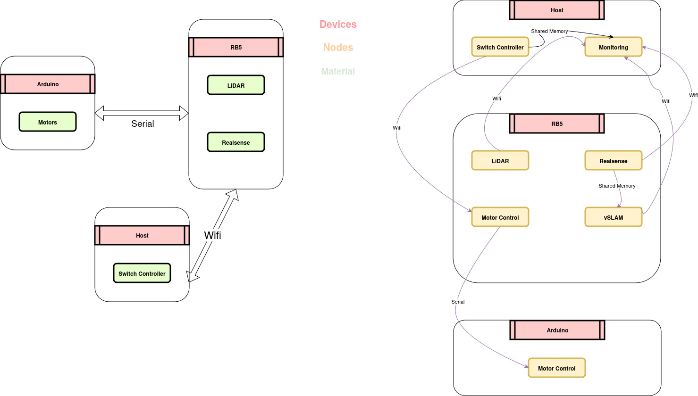

# MarCSRover : la plateforme de développement pour les véhicules autonomes 100% Python 3.12

Marcs Rover est un projet du pôle projet Véhicule Autonome de CentraleSupélec. Nous utilisons pour ce projet un ordinateur embarqué
de chez Qualcomm, le RB5. Ce projet est un projet de recherche et développement, et a pour but de développer un véhicule autonome
capable de se déplacer dans un environnement urbain et de fournir une véritable **plateforme de développement** pour les étudiants
facilement utilisable et modifiable.

Nous tenons à remercier Qualcomm pour leur soutien et leur aide dans ce projet.

# Modernité

Nous avons voulu proposer une plateforme de développement facile et moderne : tout se fait en Python 3.12, avec un outil de gestion
(`uv`), un framework de communication IPC (`zenoh`) qui permet de développer la plateforme sous la forme d'un graph de tâches.

J'ai également (Enzo Le Van) déployé un serveur de CI/CD pour construire les wheels de dépendances pour Python 3.12, et les partager
sur ce repository (pour `pyrealsense2` notamment). Cela permettra à n'importe qui d'avoir sur son ordinateur tout ce qu'il faut pour développer,
que ce soit sur Linux, Windows, MacOS (sauf MacOS x86_64) y compris sur la carte RB5.

# Documentation

**End to End project**: Notre but a été de proposer un projet simple, après avoir cloné le repository et installé `uv`, tout se programme
en python très facilement sans se soucier des dépendances, des versions de python etc... Le projet installera (avec `uv`) tout seul le bon
python pour le bon système, créera un environnement virtuel et installera les dépendances souhaitées.

## Sur la voiture

Après avoir cloné le repository il faut éxécuter, **sur la voiture évidemment** :

```bash
uv sync --extra car
uv run marcsrover-car IP_ADDRESS_OF_WIFI/ETH_INTERFACE_OF_THE_CAR
```

## Sur votre ordinateur

Après avoir cloné le repository il faut éxécuter :

```bash
uv sync --extra host
uv run marcsrover-host IP_ADDRESS_OF_WIFI/ETH_INTERFACE_OF_THE_CAR
```

Merci de suivre la [documentation](documentation/src/SUMMARY.md) pour plus d'informations sur le projet.

# Version 1.0: Véhicule non autonome


